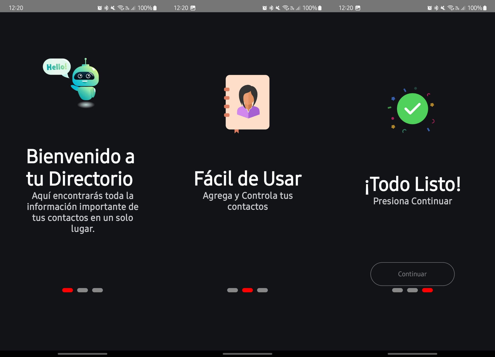
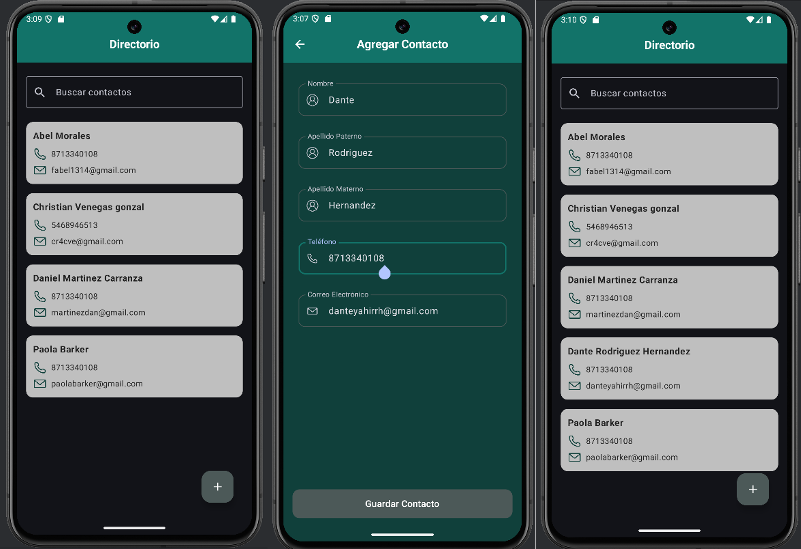
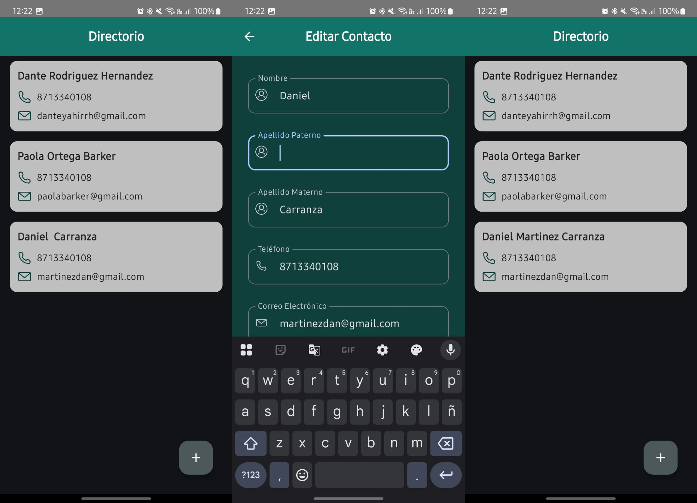
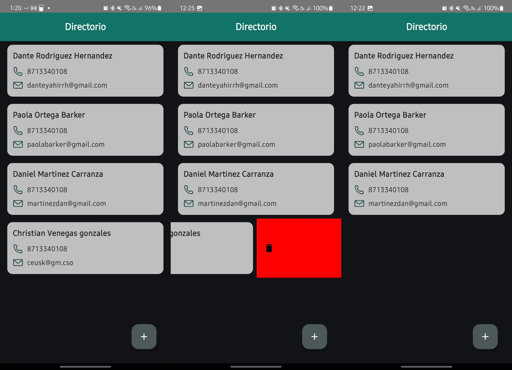
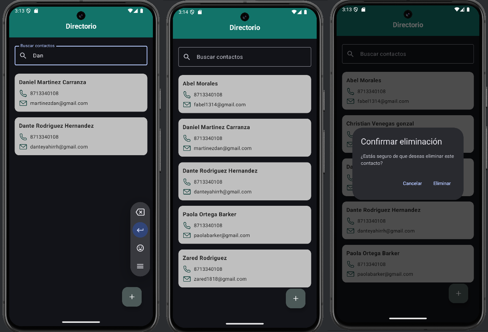

# 📇 DirectorioApp

**DirectorioApp** es aplicación móvil desarrollada en **Kotlin** usando **Jetpack Compose**, cuyo objetivo es gestionar un directorio de contactos de forma eficiente y moderna. La app ofrece una introducción animada (OnBoarding), así como funcionalidades para agregar, editar, eliminar y visualizar contactos.

---

## Características principales

- Splash screen y OnBoarding animado con **Lottie**
- Almacenamiento del estado del OnBoarding usando **DataStore**
- Vista principal con lista de contactos
- Agregar contacto
- Editar contacto existente
- Eliminar contacto
- Navegación con **Navigation Compose**
- Persistencia con **Room**
- Inyección de dependencias con **Hilt**

---

## Tecnologías usadas

| Tecnología | Uso |
|-----------|-----|
| **Kotlin** | Lenguaje principal |
| **Jetpack Compose** | UI declarativa |
| **Navigation Compose** | Navegación entre pantallas |
| **DataStore Preferences** | Persistencia del estado del OnBoarding |
| **Room** | Base de datos local |
| **Dagger Hilt** | Inyección de dependencias |
| **Lottie Compose** | Animaciones del OnBoarding |
| **Accompanist Pager** | Carrusel de pantallas en OnBoarding |

---

## Capturas de pantalla

### OnBoarding


### Agregar Contacto


### Editar Contacto


### Eliminar Contacto


### Nuevas Funciones


---

## Requisitos

- Android Studio Giraffe o superior
- Android SDK 24+
- Kotlin 1.9+
- Conexión a internet para cargar dependencias

---

## Cómo ejecutar

1. Clona el repositorio:

   ```bash
   git clone https://github.com/danyroh1/DirectorioApp.git
